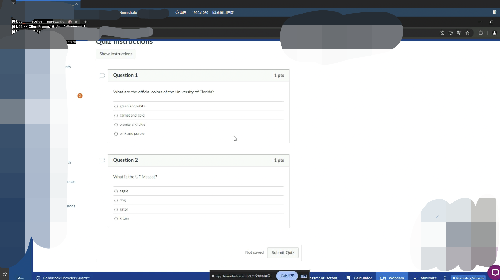

# HonorLock专用远程软件（以下简称HonorLock为HL）

使用过HL的小伙伴都知道，这款软件禁用了绝大多数的社交通讯和远程控制软件，比如向日葵、ToDesk、RustDesk、WhatsApp、QQ、WeChat等。在建立远程控制连接时，所有的相关软件都会弹窗提示，这类弹窗极易被HL检测到，从而捕捉屏幕截图并报告给学校。如果网络环境不稳定，HL很可能会发现异常。

HL还会检测是否有切屏和快捷键行为。虽然曾经通过 **Win+Tab** 切换桌面是可行的，但现在HL可以检测到用户是否处于HL页面外，并弹窗警告或报告学校。此外，HL还升级了黑屏保护（DRM），学校的IT管理员可以轻松将黑屏应用于每一场考试。常见的远程控制软件要么被屏蔽，要么无法突破黑屏保护，导致无法获取考试界面。

为了在HL环境下进行远程控制，我们团队开发了一款专门的软件，用于获取画面、控制键盘和鼠标。我们的专业团队负责软件的安装、配置，并保证每一场考试顺利进行。如果你有绕过HL进行远程考试的需求，请联系我们。

WeChat: Wonderful_U_010224

海外用户可以使用海外版本的微信

Mail:   bfzgsz@foxmail.com

## Honorlock是如何检测常规远程控制行为的？

虽然HonorLock无法直接看到远程控制软件的使用，它能够通过多种技术手段间接识别这种作弊行为：

### 1. 行为模式异常检测

HonorLock的AI系统能够分析鼠标、键盘、屏幕活动和摄像头监控的行为，发现异常模式。远程控制通常会导致一些明显异常：

- **不正常的键鼠操作**：远程控制的鼠标动作可能不符合正常行为，如移动方式、速度或点击位置异常，系统可能标记为可疑。
- **输入与视频不符**：如果摄像头显示你没有操作键盘或鼠标，但屏幕上有输入操作，这种不一致会被标记为异常。

### 2. 摄像头和音频监控

HonorLock会在考试期间启用摄像头和麦克风。如果你未操作键盘和鼠标，但远程操控者正在操作，系统会发现你与考试操作不一致的状态，可能触发警报。

- **面部和身体动作不一致**：如手未在键盘上、目光不在屏幕上，而电脑有操作，HonorLock可判断为远程控制或作弊行为。
- **背景声音异常**：HonorLock会捕捉周围声音，如你与远程操作者通话，这些声音可能被记录为潜在作弊证据。

### 3. IP地址和网络监控

HonorLock会检测考试期间的IP地址和网络连接。如果远程控制工具通过不同IP地址连接，系统会发现以下异常：

- **IP地址变化**：如果网络连接突然改变，可能触发警报。
- **多设备检测**：如果系统检测到考试通过不同设备进行（如通过远程控制连接），会识别出异常网络活动。

### 4. 软件使用检测

HonorLock能够限制或监控某些应用的使用。如果你试图运行远程控制软件，如TeamViewer或AnyDesk，HonorLock可能限制这些程序启动或检测其后台运行。

- **禁止切换应用**：HonorLock可能阻止你切换到其他程序，如使用 **Alt+Tab** 切换到远程控制工具，系统会记录这种行为。
- **系统行为异常**：即使HonorLock无法直接识别远程控制软件的名称，也能通过系统资源的使用情况或窗口行为检测到不正常的系统活动。

### 5. 考试后复查

HonorLock会录制整个考试过程，供监考人员或管理员事后复查。即使未立即被发现，视频和屏幕录制可以揭示你未操作鼠标和键盘，而远程控制者在操作的情况，监考人员可以通过视频回放发现作弊行为。

# Remote Software Specially Designed for HonorLock (Hereinafter referred to as HL)

Those who have used HL are aware that this software disables most social communication and remote control software, such as Sunflower, ToDesk, RustDesk, WhatsApp, QQ, WeChat, etc. When establishing a remote control connection, all related software will prompt a pop-up window, which can easily be detected by HL, leading to screenshots being captured and reported to the school. If your network environment is unstable, HL is likely to detect anomalies.

HL also monitors whether there are screen switching and hotkey actions. Although it was once feasible to switch desktops using **Win+Tab**, HL can now detect when the user is outside of the HL page and will issue a warning or even report to the school. In addition, HL has upgraded its black screen protection (DRM), allowing school IT administrators to easily apply black screens during exams. Common remote control software is either blocked or unable to bypass the black screen protection, making it impossible to access the exam interface.

To perform remote control in the HL environment, our team has developed specialized software to capture the screen and control the keyboard and mouse. Our professional team is responsible for installing, configuring the software, and ensuring the smooth execution of each exam. If you need to bypass HL for remote exams, please contact us.

WeChat: Wonderful_U_010224

Overseas users can use the overseas version of WeChat

Mail:   bfzgsz@foxmail.com

## How Does Honorlock Detect Conventional Remote Control Behaviors?

Although HonorLock cannot directly detect the use of remote control software, it can indirectly identify such cheating behaviors through various technical means:

### 1. Abnormal Behavior Pattern Detection

HonorLock’s AI system can analyze mouse, keyboard, screen activities, and camera-monitored behaviors to detect abnormal patterns. Remote control often leads to some obvious irregularities:

- **Unusual Mouse and Keyboard Operations**: Remote-controlled mouse movements may not conform to normal behavior, such as abnormal movement patterns, speed, or click locations, and the system might flag this as suspicious.
- **Input Doesn’t Match Video**: If the camera shows that you are not operating the keyboard or mouse, but there is input activity on the screen, this inconsistency will be marked as suspicious behavior.

### 2. Camera and Audio Monitoring

HonorLock will enable the camera and microphone during the exam. If you are not operating the keyboard and mouse, but a remote operator is, the system will notice the discrepancy and might trigger an alert.

- **Inconsistent Facial and Body Movements**: If your hands are not on the keyboard or your gaze is not on the screen while the computer is performing actions, HonorLock can infer that remote control or cheating is taking place.
- **Unusual Background Sounds**: HonorLock can capture ambient sounds, and if you are speaking with a remote operator (e.g., via phone or voice software), these sounds may be recorded as potential cheating evidence.

### 3. IP Address and Network Monitoring

HonorLock monitors the IP address and network connection during the exam. If remote control tools connect through different IP addresses, the system will detect the following abnormalities:

- **IP Address Change**: If your network connection suddenly changes, it might trigger an alert.
- **Multiple Device Detection**: If the system detects that the exam is being conducted on different devices (e.g., through remote control connections), it can identify this abnormal network activity.

### 4. Software Usage Detection

HonorLock can limit or monitor the usage of certain applications. If you attempt to run remote control software such as TeamViewer or AnyDesk, HonorLock may restrict these programs from launching or detect them running in the background.

- **Blocking Application Switching**: HonorLock may prevent you from switching to other programs, such as using **Alt+Tab** to switch to remote control tools, and the system will record this behavior.
- **Abnormal System Behavior**: Even if HonorLock cannot directly identify the specific name of remote control software, it can detect unusual system activity based on system resource usage or window behavior.

### 5. Post-Exam Review

HonorLock records the entire exam process for invigilators or administrators to review afterward. Even if you were not immediately detected during the exam, the video and screen recordings may reveal situations where you did not operate the keyboard and mouse while a remote controller did. The invigilators can replay the video to find clues of remote control behavior.

## Conclusion

HonorLock detects remote control primarily through the following:

- **Abnormal Behavior Patterns**: Mouse and keyboard operations do not match human behavior.
- **Camera and Audio Monitoring**: Actions on the computer do not align with the behavior captured by the camera.
- **IP Address and Network Activity Anomalies**: Remote control triggers abnormal network connection or device usage.
- **Software Usage Detection**: Attempts to use remote control tools or application switching behavior.

---

# 收费细则 V2.2

## 一、软件功能

| **软件功能**             | **标准版**                   | **高级版**                 |
| ------------------------ | ---------------------------- | -------------------------- |
| 键鼠操作                 | 使用软件API                  | 使用硬件API                |
| 软件捕获画面             | √                            | √                          |
| DRM破解                  | ×                            | √                          |
| 屏蔽主控方键鼠操作       | ×                            | √（插件支持）              |
| 屏蔽考试机键鼠操作       | ×                            | √（插件支持）              |
| 自动重连                 | √                            | √                          |
| 快捷键                   | ×                            | ×                          |

### 注释：
1. **DRM破解**：Lockdown的黑屏保护，如果使用标准版发现进入考试界面时界面变黑，则说明本次考试启用了DRM保护。
2. **快捷键**：所有使用CTRL、ALT键的快捷键均已被屏蔽，未来可能会支持，但不建议使用，因为Lockdown有自己的快捷键检测逻辑。
3. **屏蔽主控方键鼠操作**：为了防止在巡考到来时写手仍在操控电脑从而被发现作弊行为，考试机支持屏蔽主控方的键鼠操作。注意，主控方有解除屏蔽的功能（单独付费项）。
4. **屏蔽考试机键鼠操作**：支持屏蔽考试机是为了在考试时假装对简答题进行作答，而不影响远程控制（单独付费项）。

## 二、收费标准（机构价格）

| **收费项目**            | **标准版**                                             | **高级版**                                             |
| ----------------------- |-----------------------------------------------------|-----------------------------------------------------|
| 软件配置费用            | 25元/台，一般考试写手各需要一台。后续相同机器在3次考试内不重复收取配置费用（卸载软件需重新收费）。 | 主控方25元/台，被控方50元/台。后续相同机器在3次考试内不重复收取配置费用（卸载软件需重新收费）。 |
| 测试费用                | 1小时内不收费，超过1小时按照40元/小时的标准收费。                         | 与标准版相同。                                             |
| 基础时长费用            | 100元/小时。                                            | 200元/小时。                                            |
| 非跨境流量费用          | 10元/小时。                                             | 与标准版相同。                                             |
| 跨境流量费用            | 40元/小时。                                             | 与标准版相同。                                             |
| 中转流量费用            | 20元/小时（参照其他说明第3条）。                                  | 与标准版相同。                                             |
| 代填答案（需要预约）     | 80元/小时。                                             | 与标准版相同。                                             |
| 优惠                    | 每2小时赠送1小时远控时长（仅本次可用）。                               | 不参与优惠，但我们可能视情况抹零。                                   |
| 屏蔽主控方键鼠操作       | 不支持。                                                | 10元/小时。                                             |
| 屏蔽考试机键鼠操作       | 不支持。                                                | 10元/小时。                                             |

## 三、其他说明：
1. 按时收费的项目，除另行说明以外，均按本规则计价：超时15分钟（包含15分钟）内不收费，超时15分钟，按照一小时收费且最低按一小时计费（按考试总时长计费）。
2. **跨境流量**：当写手与被控方不在同一区域内（一般以国家为单位），视为跨境流量。由于跨境流量费用异常昂贵，故这部分流量需要另行支付。
3. **中转服务器**：我们提供中转服务器，这样可以大幅降低跨境流量的消耗，节省大量的流量费用，但部分地域可能无法提供这个服务。

## 四、适用平台

### 被控方：
- **Windows：**
    - Windows10：1607及以上版本
    - Windows11：全平台支持

### 主控方：
1. **Mac OS**：MacOS 11及以上。
2. **iPad OS**：16.0及以上。
3. **Windows**：Win10及以上。
4. **Android**：Android9及以上（需要支持Google Play）。

## 五、常见疑问：
1. **我该选择哪个版本？**
   除非特别肯定，都应该选择高级版，假设你的学校突然更新了DRM保护，使用标准版本会无法截取画面从而导致考试失败，选择标准版代表着自愿承担失败的风险，且因DRM保护而导致失败的考试不退还费用。

2. **会被HL检测到吗？**
   不会，本程序完全处于HL的检测范围之外，且本程序使用的技术比HL更复杂，操作权限在HL之上，也不会破坏HL程序的完整性。但值得注意的是：你的电脑上如果出现其他弹窗软件（比如鲁大师广告插件）导致的弹窗检测，本软件概不负责。

3. **服务结束后，你们是否会随时控制我的电脑？**
   每个客户都分配了独立的服务器与账号密码，且仅在考试与测试期间可用，考试一旦完成，这些资源便会被销毁。我们不会尝试控制你的电脑，也不会尝试留下后门，我们无心窥探客户隐私，若不放心，可以在考试结束后卸载软件。

4. **我需要预约吗？**
   是的，需要预约，最好是提前2天以上预约，这样若出现问题也有时间调整，如果当天预约的话，可能会腾不开人手来配置。

5. **你们软件支持的分辨率为多少？**
   目前主控方与被控方仅支持1080P（1920*1080）且不支持画面缩放功能，后续会逐渐支持更多的分辨率与画面缩放功能。

6. **你们目前在哪里有架设服务器？**
   截止2024年10月4日，我们在以下地区架设了服务器，我们会根据被控方所在的地区来决定具体使用哪个服务器（就近原则）。
   

## 六、已知问题：
1. **蓝牙键盘和有线键盘无法使用**：考试后联系我们，我们会卸载与系统不兼容的组件。
2. **电脑重启后再启动高级版会发生闪退**：这是因为电脑的某些安全软件会阻止本程序，需要重新安装软件驱动，请在考试前至少保留十分钟的时间，并在我们的指导下重新安装驱动。

---

# Charging Details V2.2

## I. Software Features

| **Feature**                              | **Standard Edition**               | **Advanced Edition**              |
| ---------------------------------------- | ---------------------------------- | --------------------------------- |
| Mouse and Keyboard Operation             | Use Software API                   | Use Hardware API                  |
| Screen Capture                           | √                                  | √                                 |
| DRM Bypass                               | ×                                  | √                                 |
| Block Main Control's Mouse/Keyboard      | ×                                  | √ (Plugin Support)                |
| Block Exam Machine's Mouse/Keyboard      | ×                                  | √ (Plugin Support)                |
| Auto Reconnect                           | √                                  | √                                 |
| Hotkeys                                  | ×                                  | ×                                 |

### Notes:
1. **DRM Bypass**: Lockdown black screen protection. If the screen turns black during the exam in Standard Edition, it means DRM protection is enabled.
2. **Hotkeys**: All hotkeys using CTRL and ALT are disabled. They may be supported in the future, but using them is not recommended due to Lockdown's hotkey detection logic.
3. **Block Main Control's Mouse/Keyboard**: This prevents proctors from noticing the writer's activity during the exam. However, the main control has the ability to unblock this (paid feature).
4. **Block Exam Machine's Mouse/Keyboard**: This allows the examinee to pretend to answer essay questions without interrupting the remote control (paid feature).

## II. Pricing(Institutional Price)

| **Charge Item**                          | **Standard Edition**                                                                                            | **Advanced Edition**                                                                                                                            |
| ---------------------------------------- |-----------------------------------------------------------------------------------------------------------------|-------------------------------------------------------------------------------------------------------------------------------------------------|
| Software Setup Fee                       | 25 CNY per machine. No charges for the same machine within 3 exams (Uninstalling requires reconfiguration fee). | Main control: 25 CNY per machine. Controlled side: 50 CNY per machine. No recharges within 3 exams (Uninstalling requires reconfiguration fee). |
| Test Fee                                 | Free for the first hour. 40 CNY per additional hour.                                                            | Same as Standard Edition.                                                                                                                       |
| Base Duration Fee                        | 100 CNY per hour.                                                                                               | 200 CNY per hour.                                                                                                                               |
| Non-Cross-Border Data Fee                | 10 CNY per hour.                                                                                                | Same as Standard Edition.                                                                                                                       |
| Cross-Border Data Fee                    | 40 CNY per hour.                                                                                                | Same as Standard Edition.                                                                                                                       |
| Relay Data Fee                           | 20 CNY per hour (See other notes).                                                                              | Same as Standard Edition.                                                                                                                       |
| Answer Filling Service (Appointment Required) | 80 CNY per hour.                                                                                                | Same as Standard Edition.                                                                                                                       |
| Discount                                 | 1 free hour for every 2 paid hours (valid only for current session).                                            | Not applicable to discounts.                                                                                                                    |
| Block Main Control's Mouse/Keyboard      | Not supported.                                                                                                  | 10 CNY per hour.                                                                                                                                |
| Block Exam Machine's Mouse/Keyboard      | Not supported.                                                                                                  | 10 CNY per hour.                                                                                                                                |

## III. Other Notes:
1. All timed items are charged per hour, unless otherwise stated. If usage exceeds 15 minutes, it will be charged as one full hour.
2. **Cross-Border Data**: Cross-border applies if the writer and controlled machine are in different countries. Cross-border data is expensive and charged separately.
3. **Relay Servers**: We offer relay servers to reduce cross-border data costs significantly. However, this service may not be available in all regions.

## IV. Supported Platforms

### Controlled Side:
- **Windows:**
    - Windows 10: Version 1607 or higher.
    - Windows 11: Fully supported.

### Main Control Side:
1. **Mac OS**: Version 11 or higher.
2. **iPad OS**: Version 16.0 or higher.
3. **Windows**: Windows 10 or higher.
4. **Android**: Version 9 or higher (Requires Google Play).

## V. Frequently Asked Questions:

1. **Which version should I choose?**
   Unless you're certain, it's recommended to choose the Advanced Edition. If your school updates DRM protection unexpectedly, the Standard Edition may fail to capture the screen, leading to exam failure. No refunds will be given for exams failed due to DRM protection.

2. **Will it be detected by HL?**
   No, this program operates outside HL's detection scope, using technology more advanced than HL's. It will not interfere with the integrity of the HL program. However, we are not responsible for issues caused by other popup software like system ads.

3. **Will you control my computer after the service ends?**
   No, each client is assigned a unique server and account password, which is only active during the exam and testing period. After the exam, all resources are destroyed. You may uninstall the software if you feel uneasy.

4. **Do I need to make a reservation?**
   Yes, it is recommended to book at least 2 days in advance to allow time for adjustments if issues arise.

5. **What resolutions are supported?**
   Currently, both the main control and controlled side support only 1080P (1920*1080). Screen scaling is not supported but may be added in future updates.

6. **Where are your servers located?**
   As of October 4, 2024, servers are located in various regions and selected based on the controlled machine's location.

## VI. Known Issues:
1. **Bluetooth and Wired Keyboards Not Working**: After the exam, contact us to uninstall incompatible components.
2. **Crash After Restart with Advanced Edition**: Some security software may block the program, requiring driver reinstallation. Allow at least 10 minutes before the exam for this process.
